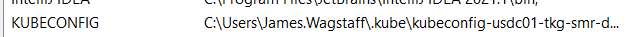
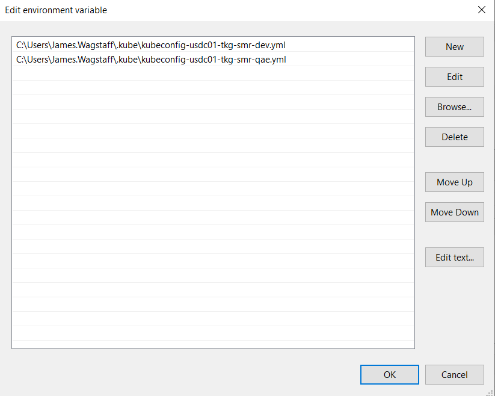
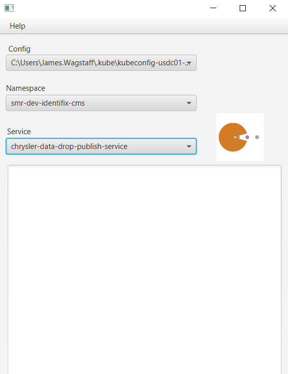
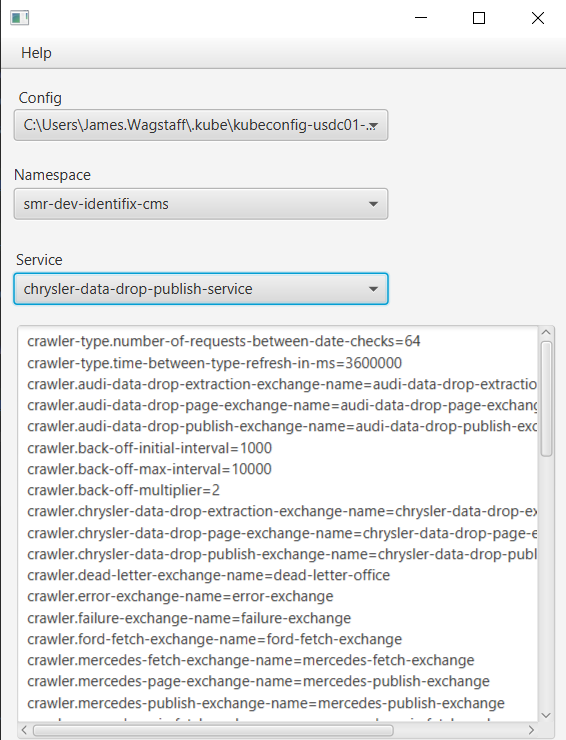

## Project Properties

This project is designed to pull properties for applications running inside any kubernetes cluster.

The project will parse the properties into a .properties style,

```
file-store.time-stamp-format=dd_MMM_yyyy-HH_mm_ss_S
file-store.chrysler-zip-path=dev/fetchedZip/
file-store.chrysler-bucket-name=chrysler-crawler-bucket
```

### How to use
This project requires kubectl to be installed and configured and also the KUBECONFIG variable to be set
in user variables.





It also requires an active vpn connection. 

### Screenshots





### Caveats
As the list of namespaces and services are loaded from the server, there is an average loading time 
of around 15 seconds, the namespaces and services are cached for a single configuration and will be 
updated when the values change.

### Issues
To open an issue visit the issues page in the repository. 
All contributions are welcome, create a pull request!